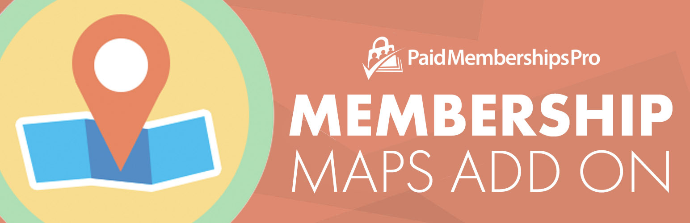

# [Membership Maps Add On for Paid Memberships Pro](https://www.paidmembershipspro.com/add-ons/membership-maps/) #
[comment]: # (Generate badges from shields.io, only works for .org plugins to get other stats etc. We'd have to create our own endpoints for Premium plugins)

### Welcome to the Membership Maps Add On for Paid Memberships Pro GitHub Repository
Display a map of members via shortcode or on the frontend pages for the [Member Directory and Profiles Add On](https://www.paidmembershipspro.com/add-ons/member-directory/) for Paid Memberships Pro.

For more information about this Add On please visit [https://www.paidmembershipspro.com/add-ons/membership-maps/](https://www.paidmembershipspro.com/add-ons/membership-maps/)

## Installation ##
For detailed installation steps, please read the [documentation](https://www.paidmembershipspro.com/add-ons/member-directory/) page.

1. Download the current development ZIP file directly: `https://github.com/strangerstudios/pmpro-membership-maps/archive/dev.zip`

**Remove `-dev` from the plugin's folder name before installation.**

## Bugs ##
If you find an issue or bug, let us know by [creating a detailed GitHub issue](https://github.com/strangerstudios/pmpro-membership-maps/issues/new).

## Support ##
This is a developer's portal for the Membership Maps Add On for Paid Memberships Pro. We do not offer support on this channel. **Any support related questions should be directed to [paidmembershipspro.com/support](https://www.paidmembershipspro.com/support).**

## Contributing to the Membership Maps Add On ##
We encourage and welcome contributions to the Membership Maps Add On. Please read the [guidelines for contributing](https://github.com/strangerstudios/pmpro-membership-maps/blob/dev/.github/CONTRIBUTING.md) to this repository.

There are various **ways to help development** of the Membership Maps Add On:

1. Report [bugs/issues](https://github.com/strangerstudios/pmpro-membership-maps/issues/new) on GitHub.
2. Work on any issues by submitting a Pull Request.

Here are some ways **non-developers can contribute** to the Membership Maps Add On:

1. Translate the Membership Maps Add On into your own [language](https://www.paidmembershipspro.com/paid-memberships-pro-in-your-language/).
2. [Purchase a Plus membership](https://paidmembershipspro.com/pricing) to help fund ongoing development and bug fixes.
